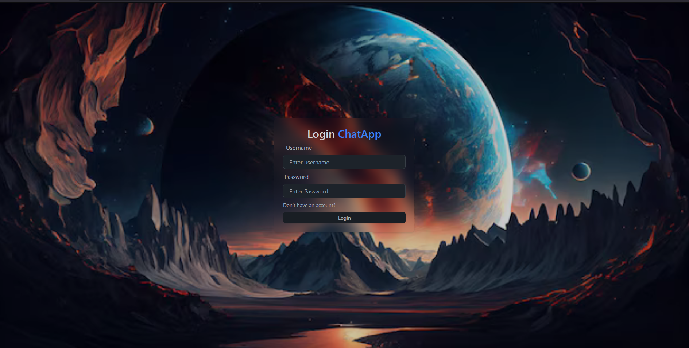
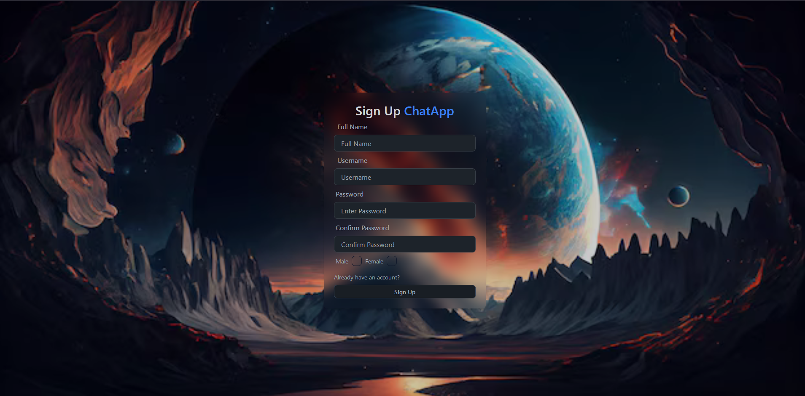
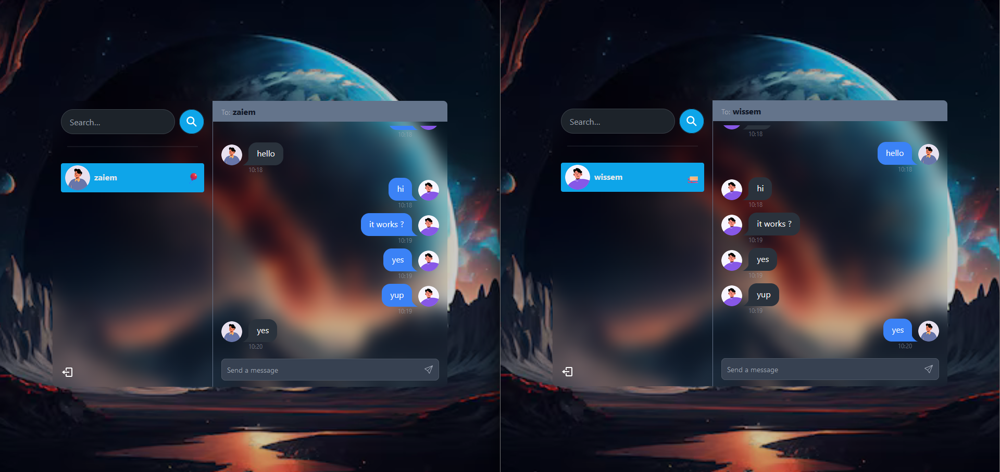

# Chat Application using MERN Stack

## Overview

This project is a real-time chat application developed using the MERN stack (MongoDB, Express.js, React.js, Node.js). It provides a secure messaging platform with features like real-time messaging, user authentication using JWT tokens, and encryption for sensitive data. The frontend is styled using Tailwind CSS and Daisy UI for a modern and responsive user interface.

## Screenshots

*Login Screen*

*Sign Up Screen*

*Chat Screen*

## Technologies Used

- **Backend**: Node.js, Express.js, MongoDB
- **Frontend**: React.js, Context API, Tailwind CSS, Daisy UI
- **Security**: JWT Authentication, bcrypt encryption, XSS prevention

## License

This project is licensed under the MIT License - see the [LICENSE](./LICENSE) file for details.
